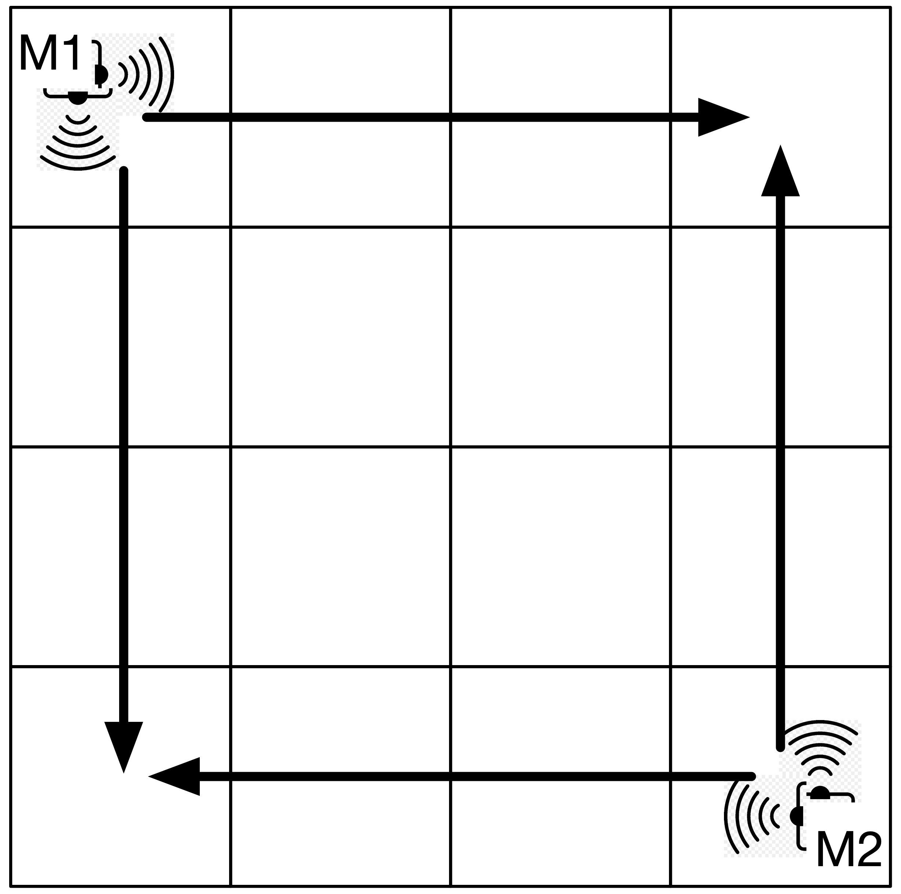
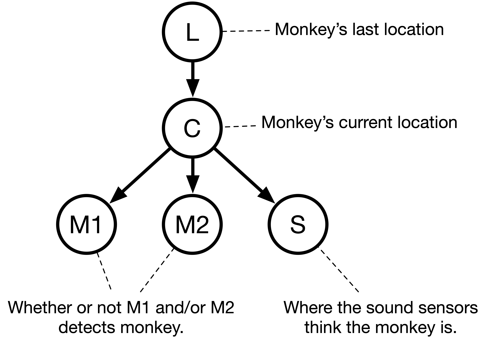

<script src="https://cdn.mathjax.org/mathjax/latest/MathJax.js?config=TeX-AMS-MML_HTMLorMML" type="text/javascript"></script>


# AI Project 3: Monkey Business
{: .no_toc }

1. TOC
{:toc}

In 1976, a group of rhesus monkeys escaped from the Memphis Zoo. They crossed North Parkway and entered the Rhodes College campus, mostly settling on the roof of Burrow Hall, which was then the library. Eventually, the monkeys were recaptured after eating some tranquilizer-laced popcorn.  Evidence: [video](https://youtu.be/rr4qA8oDFDY).

Now, the monkeys have escaped again, and again decided to visit the Rhodes campus. They have all been captured except one very sneaky monkey who is has taken up residence in the BCLC ballroom. However, nobody can seem to locate the monkey in the ballroom, since it mostly hides and only comes out from time to time. Rhodes College has turned to you to use your AI skills to capture the monkey.

## Problem setup

You choose to represent the ballroom as a two-dimensional grid, with $$m$$ rows and $$n$$ columns. 
You know the monkey must be in one of the grid squares, but you don’t want to wait around all day to capture it, 
so you decide to install some motion and sound sensors that will alert you whenever the monkey comes out of hiding.

**Motion Sensors:**  You have two motion sensors, but they are not very sophisticated. Each one only detects objects either directly 
ahead of it, or 90 degrees to the side. You decide to put one motion sensor at location (0, 0) — the top left 
corner of the room, and the other location $$(m-1, n-1)$$ — the bottom right corner, like so:



The top-left motion sensor (labeled M1) will detect the monkey if it is in the top row or the left column, whereas the 
bottom-right sensor (M2) will detect the monkey if it is in the bottom row or the right column. The middle squares of the 
grid are therefore not covered by either sensor, and if the monkey is in one of those squares, it is effectively "invisible."

Furthermore, sometimes these motion sensors detect other things besides the monkey in their lines of sight, and sometimes, 
if the monkey is far enough away from one, there’s a chance it won’t be detected at all.

**Sound Sensors**: Luckily the entire ballroom is wired with microphones, so they can detect the specific 
square the monkey is in, but they’re not perfect. Sometimes they report that the monkey is in a neighboring square, rather than the true square where the monkey is.

## The Bayes net

You decide to set up the Bayes net as follows:



We describe the conditional probability tables **(CPTs)** below, because they are a bit more complicated than what we’ve used before. In 
particular, while $$M1$$ and $$M2$$ are binary random variables (whether or not the monkey is detected given its current location), $$L$$, $$C$$, and $$S$$ 
are random variables whose values are are  _locations_  (ordered pairs), not booleans.

### Last location ($$L$$)

This is a random variable that is an ordered pair. The monkey may be in any square in the room, so $$L$$ may take any value from (0, 0) up to ($$m-1$$, $$n-1$$). 
In other words, for a 3x3 grid, random variable $$L$$ has nine possible values.

The CPT for $$L$$ is initialized in a uniform manner. That is, when the program begins, the monkey is equally likely to be anywhere, so 
$$P( L=(r,c) ) = \dfrac{1}{m \cdot n}$$. For example, on a 3x3 grid, all squares are initially assigned the probability 1/9.

However, the CPT for $$L$$ will be  _modified_  as the program runs. Specifically, after every time step, we will update the CPT for $$L$$ 
with the current CPT for $$C$$. In other words, after we calculate the probability distribution for where the monkey currently is at time step $$n$$ (random variable $$C$$),
that will become the probability distribution for $$L$$ at time step $$n+1$$.  (This is not usually done for Bayes nets; the CPTs are usually static, but this makes the
problem more interesting.)

### Current location ($$C$$)

This is a random variable that is an ordered pair. Similarly to $$L$$, C may also take any value from (0, 0) up to ($$m-1$$, $$n-1$$). The monkey’s 
current location is conditioned on its last location. In particular, at each time step, the monkey takes take one step up, 
down, left, or right, unless it is on the edge of the grid, in which case it may not move off the grid. The monkey must always 
move, it may never stay still. Since we have no idea which move the monkey will actually make, we assume each of the possible moves is equally likely. 
(Note that there may be two, three, or four possible moves based on if the monkey is in a corner, next to a wall, or in the middle area of the board).

For example, here is a section of the CPT for a 3x3 grid:


<table>
  <thead>
    <tr>
      <th>L</th>
      <th>C</th>
      <th>P(C | L)</th>
    </tr>
  </thead>
  <tbody>
    <tr>
      <td>(0, 0)</td>
      <td>(0, 1)</td>
      <td>1/2</td>
    </tr>
    <tr>
      <td>(0, 0)</td>
      <td>(1, 0)</td>
      <td>1/2</td>
    </tr>
    <tr>
      <td>(0, 1)</td>
      <td>(0, 0)</td>
      <td>1/3</td>
    </tr>
    <tr>
      <td>(0, 1)</td>
      <td>(0, 2)</td>
      <td>1/3</td>
    </tr>
    <tr>
      <td>(0, 1)</td>
      <td>(1, 1)</td>
      <td>1/3</td>
    </tr>
    <tr>
      <td>(1, 1)</td>
      <td>(0, 1)</td>
      <td>1/4</td>
    </tr>
    <tr>
      <td>(1, 1)</td>
      <td>(1, 0)</td>
      <td>1/4</td>
    </tr>
    <tr>
      <td>(1, 1)</td>
      <td>(2, 1)</td>
      <td>1/4</td>
    </tr>
    <tr>
      <td>(1, 1)</td>
      <td>(1, 2)</td>
      <td>1/4</td>
    </tr>
  </tbody>
</table>


You should be able to see that if the last location of the monkey ($$L$$) is (0, 0), then there are two equally-likely locations where it may be currently ($$C$$).
If the monkey was previously at (0, 1), there are three possible new locations, and if the monkey was previously at (1, 1), there are four.
Obviously the real table is much longer, with rows for all possible values of $$L$$ and $$C$$ (though some combinations of $$L$$ and $$C$$ are not possible, so 
$$P(C \mid L) = 0$$ for those cases.)

### Motion sensors (M1 and M2)

Each motion sensor random variable, $$M1$$ and $$M2$$, is a binary random variable, that may be true or false, depending on the monkey’s current location. 
Recall that each motion sensor can only detect the monkey in certain areas of the grid, but sometimes the sensors will make mistakes.

The conditional probabilities for $$M1$$ and $$M2$$ are as follows:

-   If the monkey is currently at location $$(r, c)$$, and  **is in $$M1$$ or $$M2$$’s line of sight**, each sensor detects the monkey with a probability 
equal to 0.9 minus 0.1 $$\cdot$$ (the number of steps away from the sensor the monkey is). In other words, if the monkey is right on top of the sensor, then the sensor detects the monkey with probability 0.9. If the monkey is one step away (but still in the sensor’s line of sight), the probability is 0.8. Two steps away is 0.7, and so on.
    
    **Example:**  on a 3x3 grid, for sensor M1 (which is at location (0, 0)), if the monkey is also at location (0, 0), then it will be detected 90% of the time (and M1 will be true). However, 10% of the time, the sensor does not detect the monkey, and M1 will be false. If the monkey is at location (0, 1) or (1, 0), it will be detected 80% of the time; at location (0, 2) or (2, 0), 70% of the time, and so on.
    
-   If the monkey is currently at location $$(r, c)$$, and  **is not in M1 or M2’s line of sight**, each sensor will still detect the monkey with probability 0.05. In other words, the sensor glitches 5% of the time and reports that the monkey is there, even when it’s not.
    

Here is the CPT for M1 for a 3x3 grid:

<table>
  <thead>
    <tr>
      <th>C</th>
      <th>P(M1 = true | C)</th>
    </tr>
  </thead>
  <tbody>
    <tr>
      <td>(0, 0)</td>
      <td>0.9</td>
    </tr>
    <tr>
      <td>(0, 1)</td>
      <td>0.8</td>
    </tr>
    <tr>
      <td>(1, 0)</td>
      <td>0.8</td>
    </tr>
    <tr>
      <td>(0, 2)</td>
      <td>0.7</td>
    </tr>
    <tr>
      <td>(2, 0)</td>
      <td>0.7</td>
    </tr>
    <tr>
      <td>(1, 1)</td>
      <td>0.05</td>
    </tr>
    <tr>
      <td>(1, 2)</td>
      <td>0.05</td>
    </tr>
    <tr>
      <td>(2, 1)</td>
      <td>0.05</td>
    </tr>
    <tr>
      <td>(2, 2)</td>
      <td>0.05</td>
    </tr>
  </tbody>
</table>

The CPT for M2 on a 3x3 grid is similar, but the motion sensor is at (2, 2), so the probabilities are rearranged.

### Sound sensor ($$S$$)

The sound sensor covers the entire room, so this random variable is a location (an ordered pair) within the room of where the sound sensor  **believes**  the monkey is.

-   60% of the time, the sound sensor correctly detects exactly where the monkey is.
-   30% of the time, the sound sensor makes a mistake, and reports that the monkey is actually in one of the adjacent squares, meaning one Manhattan-unit-step away (up, down, left, right). This 30% is divided equally among the possible squares that are one unit away. If the monkey is not next to a wall, there are four possible squares that are one unit away, but if the monkey is next to a wall or in a corner, then this might be three or two.
-   10% of the time, the sound sensor makes a larger mistake, and reports that the monkey is actually in one of the squares that is  **exactly**  **two**  Manhattan-steps away. This 10% is divided equally among the possible squares that are two units away. If the monkey is at least two steps away from any wall, there are eight possible squares that are exactly two units away. If the monkey is closer to a wall than two units, however, this number will be less, and the 10% should be divided equally among the possibilities.

**Example**: Let’s say that on a 3x3 grid the monkey is at location (0, 0). (So C = (0, 0)). Then the sound sensor correctly reports that the monkey is at (0, 0) with probability 0.6. The sensor (incorrectly) reports that the monkey is one unit away with probability 0.3. There are two possible squares that are one unit away from (0, 0), so each one gets probability 0.15. The sensor (incorrectly) reports that the monkey is two units away with probability 0.1 (1/10). There are three possible squares that are one unit away from (0, 0), so each one gets probability 1/30.

```
P(S = (0, 0) | C = (0, 0)) = 0.6
P(S = (0, 1) | C = (0, 0)) = 0.15
P(S = (1, 0) | C = (0, 0)) = 0.15
P(S = (2, 0) | C = (0, 0)) = 1/30
P(S = (1, 1) | C = (0, 0)) = 1/30
P(S = (0, 2) | C = (0, 0)) = 1/30
```
The probability of $$S$$ being any other square is zero.  Note that the probabilities above sum to 1.

## What your program will do

Your program must read in a text file containing a sequence of the three sensor readings (M1, M2, and S). All three sensor readings are always provided. You must calculate and display the probability of the monkey being at every possible square in the grid at every time step.

### Bayes net calculation

You are provided with sensor readings for $$M1$$, $$M2$$, and $$S$$, so those are your evidence variables. Your query variable is $$C$$. The only unknown is $$L$$. Assume your evidence $$e$$ 
is the sensor readings $$m1$$, $$m2$$, and $$s$$.

The probability you are looking for is:

$$\begin{aligned} P(c \mid m_1, m_2, s) &= \frac{P(c, m_1, m_2, s)}{P(m_1, m_2, s)} = \alpha \cdot P(c, m_1, m_2, s) \\
  &= \alpha \sum_{l \in L} P(l, c, m_1, m_2, s) \\
  &= \alpha \sum_{l \in L} P(l) P(c \mid l) P(m_1 \mid c) P(m_2 \mid c) P(s \mid c) 
\end{aligned}$$


I do not want your program to simplify any further like we did in class, by pulling terms out of the summation. You can do that if you want, but we’re going to keep the calculation easy.

Note that the equation above will give you a probability that is not normalized, in that all the probabilities for the various values of $$C$$ will not sum to 1. This is because of the 
normalization constant $$\alpha$$ in front. To make the probabilities sum to 1, add them up and divide each probability by the total sum.

### Text file

Your program will prompt to open a text file. The first line of the text file will always have two integers on it, that will be the size of the grid in rows and columns $$(m, n)$$. 
Each subsequent line will have four integers on it, corresponding to the first motion detector reading (0=false, 1=true), the second motion detector reading, and the sound sensor 
reading as a location.

Here’s an example:

```
2 2             // 2 rows by 2 columns
1 1 0 1         // Timestep 0, M1=true,  M2=true, S=(0, 1)
0 1 1 1         // Timestep 1, M1=false, M2=true, S=(1, 1)
0 0 1 1         // Timestep 2, and so on...
1 0 1 0
```

### Printing results

After your program reads the text file, it must print out **the starting distribution for $$L$$**, which will always be equal probabilities in all squares. Then, your program must print out, 
for every time step, **the probability, for every available square, of the monkey being in that square**.  _Remember that after each time step, the current distribution for $$C$$ becomes the next starting 
probability distribution for $$L$$!_  (This is called a  [dynamic bayes net](https://en.wikipedia.org/wiki/Dynamic_Bayesian_network).)

## Sample output

Zipped file:  [All Monkey Files](monkeyOutput.zip)

Text file:  [monkey1.txt](monkey1.txt)  Output:  [m1-output.txt](m1-output.txt)  Debugging:  [m1-debug.txt](m1-debug.txt)

Text file:  [monkey2.txt](monkey2.txt)  Output:  [m2-output.txt](m2-output.txt)  Debugging:  [m2-debug.txt](m2-debug.txt)

Text file:  [monkey3.txt](monkey3.txt)  Output:  [m3-output.txt](m3-output.txt)  Debugging:  [m3-debug.txt](m3-debug.txt)

Text file:  [monkey4.txt](monkey4.txt)  Output:  [m4-output.txt](m4-output.txt)  Debugging:  [m4-debug.txt](m4-debug.txt)

## Guidelines

-   I  **highly**  suggest you include a debugging constant in your code that can be turned on and off. When this constant is on, you should print out the entire CPTs at the beginning of your code, as well as the probabilities you are multiplying together to get each individual joint probability, as well as the un-normalized probabilities before normalizing. My debugging output includes this, and it will help you immensely, because it basically shows every number my program is using.
-   When displaying the probabilities that the monkey is in each square of the grid, you should format your probabilities as decimals rounded to 8 decimal places. This makes it easy to read and compare to mine.
-   Your probabilities may not match mine exactly due to rounding, but they should be close.  You may want to use the Python [`decimal` library](https://docs.python.org/3/library/decimal.html) or the Java
	[`BigDecimal` class](https://docs.oracle.com/en/java/javase/17/docs/api/java.base/java/math/BigDecimal.html) to do this.  (My sample output is from Python
	code with the `decimal` library.)

## Hints

-   One thing that proved  _extremely_  useful in my solution was to make a few functions that would generate lists or sets of (row, col) locations for me, given different criteria. For example, I wrote functions to:
    
    -   generate a list of all possible $$(r, c)$$ locations on the board
    -   generate a list of all possible $$(r, c)$$ locations one Manhattan-step away from a location
    -   generate a list of all possible $$(r, c)$$ locations two Manhattan-steps away from a location
    
    Each of these functions was aware of how big the grid was, so it could only generate legal locations based on the grid size.
    
-   This project, unlike the previous ones, doesn’t create very much information during runtime that must be stored in objects or data structures. It still may be useful to use an object-oriented style of programming, but you shouldn't feel like you need to make everything into a class. I chose to make classes for each of my probability distributions (i.e., a class for the previous location distribution, a class for the current location distribution, a class for the motion sensor distribution, and a class for the sound sensor distribution), but you could just as easily write a bunch of functions that don’t live inside a class.
    
-   While this project doesn’t use a lot of dynamically-generated objects, you  _should_  figure out a way to store all the numeric data. Here’s what I did (you don’t have to follow this, but if you have no idea how to set everything up, it might give you some guidance)
    
    -   I wrote classes for each of the probability distributions I needed to represent (L, C, M1/M2 together, and S).
    -   Each class is only in charge of calculating its own probability, given specific values of its parent variables.
    -   I chose to represent every probability distribution for a random variable (whether inside or outside of a class) by a map, where the key was a setting of the random variable, and the value was the corresponding probability. This makes it easy to loop over the distribution. In Python these would be dictionaries. C++, you could use a  `map`  or  `unordered_map`. In Java, `HashMap` or `TreeMap` works fine.
    -   Note that the only distribution that isn’t conditioned on a parent is L. Therefore storing L’s distribution is easy, because the CPT isn’t conditioned on anything. You just need a map from (r, c) locations to probabilties. Storing the others (C, M1, M2, S) is harder, because the CPT is conditioned on a parent variable. It’s harder because there’s a different distribution for each setting of the parent variable. You can either pre-generate all of them, or generate them on the fly (I did the latter).
    -   Each class has a function called  `get_distrib`  that retrieves the whole distribution, given a specific setting for the parent variable(s).
    -   Each class has a function called  `get_prob`  that retrieves just a single probability from the distribution, given a specific setting for the parent variable  _and_  the setting of the variable in question.
 
-   Suggested order for writing code:
    
    -   Write functions to generate lists of locations given criteria (see above).
    -   Start with a strategy for generating the distribution for L. You should be able to retrieve the whole distribution at once or a single probability. You can either make a class for this, or a few related functions.
    -   Write functions that can generate the probability distribution for the other variables.
    -   Write a function to generate a single probability for a value of C, given values of M1, M2, and S.
    -   Write a function to generate a probability distribution over all possible values of C, given values of M1, M2, and S.
    -   Put it all together!


## At the end of the project

-   As you are preparing to submit the project, please prepare a text file (`.txt`, pdf, or Word doc is fine) answering the following questions:
    1.  What bugs and conceptual difficulties did you encounter? How did you overcome them? What did you learn?
    2.  Describe whatever help (if any) that you received. Don’t include readings, lectures, and exercises, but do include any help from other sources, such as websites or people (including classmates and friends) and attribute them by name.
    3.  Describe any serious problems you encountered while writing the program.
    4.  Mention any challenges that you did.
    5.  List any other feedback you have. Feel free to provide any feedback on how much you learned from doing the assignment, and whether you enjoyed doing it.
-   Please also add a comment at the top of your program stating your name and a pledge that you have followed the honor code and collaboration policy for this project. This can be as simple as writing “**I have neither given nor received unauthorized aid on this program.**” You can find the collaboration policy on the syllabus.

## Grading

-   Your project will be graded on the correctness of your program, in particular:
    -   whether your program’s output matches mine. The output does not have to match word-for-word, but the  _numbers_  should match and the format should be easy to read.
-   Your project will also be graded on the appropriateness and efficiency of the algorithms you choose, and on coding style.

## Submission instructions

To submit, upload all your source code files to canvas, including **your name and honor pledge**.  Make sure to also submit your **answers to the post-project questions**

Before submitting, make sure that you've included all the requirements for this project!  You can double-check by searching this page (ctrl+f or command+f) for **'must'**; important details related to the assignment are also highlighted for your convenience.

## Challenges
- Use your favorite graphics library to present the output as a grid of squares which change color with the probabilities, showing hot and cold zones for where the monkey is.  You could use, for instance, shades of blue and red that gradually change as the monkey moves around.
- Invent more variables for the Bayes net (e.g., more sensors) and add them to the project.  If you do this challenge, turn in one copy of the code for the original project and a modified one for the challenge.
